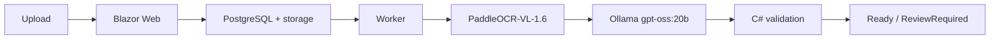

# AJK Document Capture

[](https://dotnet.microsoft.com/)
[](https://learn.microsoft.com/dotnet/csharp/)
[](https://dotnet.microsoft.com/apps/aspnet/web-apps/blazor)
[](https://www.postgresql.org/)
[](https://www.paddleocr.ai/)
[](https://ollama.com/)
[](https://www.docker.com/)

Aplikacja do bezpiecznego przechwytywania faktur i paragonów z NIP. Przetwarza dokument przez lokalny pipeline OCR, mapuje wynik do kanonicznego JSON i kieruje go do walidacji lub ręcznego review. Eksport XML/PDF do ERP jest planowany jako kolejny etap.



## Szybki start

Wymagania: .NET SDK 10, Docker Desktop oraz dostępny Ollama z modelem `gpt-oss:20b`.

```bash
cp deploy/.env.example deploy/.env
# Ustaw OLLAMA_BASE_URL i bezpieczne dane PostgreSQL w deploy/.env.
./scripts/dev-up.sh
```

Pierwszy start pobiera model PaddleOCR-VL do named volume i może potrwać kilka minut. Aplikacja nasłuchuje domyślnie tylko lokalnie na `http://127.0.0.1:8088`; użyj `WEB_PORT`, aby zmienić port.

## Weryfikacja

```bash
dotnet format InvoiceCapture.slnx --no-restore --verify-no-changes
dotnet build InvoiceCapture.slnx -c Release --no-restore
dotnet test InvoiceCapture.slnx -c Release --no-build
```

Stan prac i kryteria ukończenia znajdują się w [planie wykonawczym](CODEX_INVOICE_CAPTURE_IMPLEMENTATION_PLAN.md). Zwięzłe diagramy procesów są w [docs](docs/README.md).

> Projekt jest w trakcie realizacji. Nie używaj go jeszcze do produkcyjnego eksportu księgowego ani jako źródła XML dla ERP.
