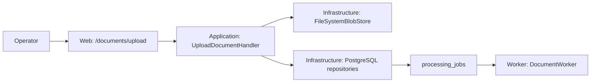

# Upload i kolejka

Upload jest strumieniowany do niezmiennej ścieżki UUID, a SHA-256 liczone podczas zapisu. `processing_jobs` zawiera idempotency key, status i lease. Worker pobiera kolejny rekord atomowo przez `FOR UPDATE SKIP LOCKED`; nie wykonuje długiego przetwarzania w żądaniu HTTP.

Akceptowane są PDF, JPEG, PNG i TIFF (limit 25 MiB). Walidacja magic bytes i liczby stron jest jeszcze do wykonania.
