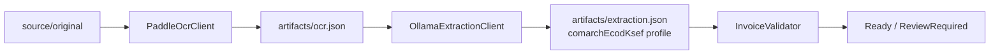

# OCR i ekstrakcja

Worker przechodzi trwałymi etapami `Normalizing → OcrRunning → Extracting → Validating`. `PaddleOCR-VL-1.6` zwraca pełny JSON, który jest zachowany w artefakcie; do gpt-oss trafia wyłącznie pole Markdown i identyfikatory bloków. Klient Ollama wysyła `/api/chat`, `stream=false`, `temperature=0` i JSON Schema; prompt traktuje OCR jako nieufny materiał oraz zabrania zgadywania.

Raw OCR i odpowiedź ekstraktora trafiają do artefaktów, nie do logów. Dane adresu Ollama pochodzą wyłącznie z `OLLAMA_BASE_URL`/konfiguracji środowiska.

Historia przetwarzania pokazuje operatorowi nazwę wykonawcy etapu bez treści dokumentu: `PaddleOCR-VL` dla OCR/layout, `Ollama gpt-oss:20b` dla ekstrakcji oraz `C# InvoiceValidator` dla walidacji.

Timeout OCR i ekstrakcji wynosi 10 min; błąd sieciowy, 5xx lub timeout jest retriowany na tym samym trwałym etapie. Licznik prób resetuje się po jego pomyślnym ukończeniu.
