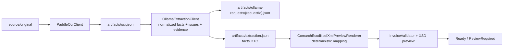

# OCR i ekstrakcja

Prompt Ollama jest celowo krótki i zwraca wyłącznie normalizowane fakty faktury, problemy oraz dowody OCR — nie XML. Kontrakt rozdziela numer faktury od numeru KSeF, nakazuje `null` i issue przy braku/konflikcie oraz dopuszcza wyłącznie bezstratną normalizację dat i separatorów liczb. Kod .NET deterministycznie dobiera elementy i ich kolejność w podglądzie Comarch, a następnie uruchamia walidację XSD. Ikony przy wpisach historii dokumentu otwierają wyśrodkowany modal z zawartością artefaktu oraz akcją kopiowania.

Worker przechodzi trwałymi etapami `Normalizing → OcrRunning → Extracting → Validating`. `PaddleOCR-VL-1.6` zwraca pełny JSON, który jest zachowany w artefakcie; do gpt-oss trafia wyłącznie pole Markdown i faktycznie odnalezione identyfikatory bloków. Klient Ollama wysyła `/api/chat`, `stream=false`, `think=medium`, `temperature=0` i JSON Schema; prompt traktuje OCR jako nieufny materiał oraz zabrania zgadywania.

Raw OCR, pełne body żądania `/api/chat` i odpowiedź ekstraktora trafiają do artefaktów, nie do zwykłych logów. Bezpośrednio przed wysłaniem Worker zapisuje niezmieniony `artifacts/ollama-requests/{requestId}.json`; historia dokumentu dostaje wpis **Ollama request sent** powiązany z tym konkretnym plikiem. Każda próba ma własny artefakt — retry ani restart nie nadpisują wcześniejszego promptu. Operator widzi dla konkretnej faktury dokładny system prompt, user prompt i OCR przekazane do Ollama, także gdy wywołanie kończy się błędem. Dane adresu Ollama pochodzą wyłącznie z `OLLAMA_BASE_URL`/konfiguracji środowiska.

Historia przetwarzania pokazuje operatorowi nazwę wykonawcy etapu bez treści dokumentu: `PaddleOCR-VL` dla OCR/layout, `Ollama gpt-oss:20b` dla ekstrakcji oraz `C# InvoiceValidator` dla walidacji.

Timeout OCR i ekstrakcji wynosi 10 min; błąd sieciowy, 5xx lub timeout jest retriowany na tym samym trwałym etapie. Licznik prób resetuje się po jego pomyślnym ukończeniu.
