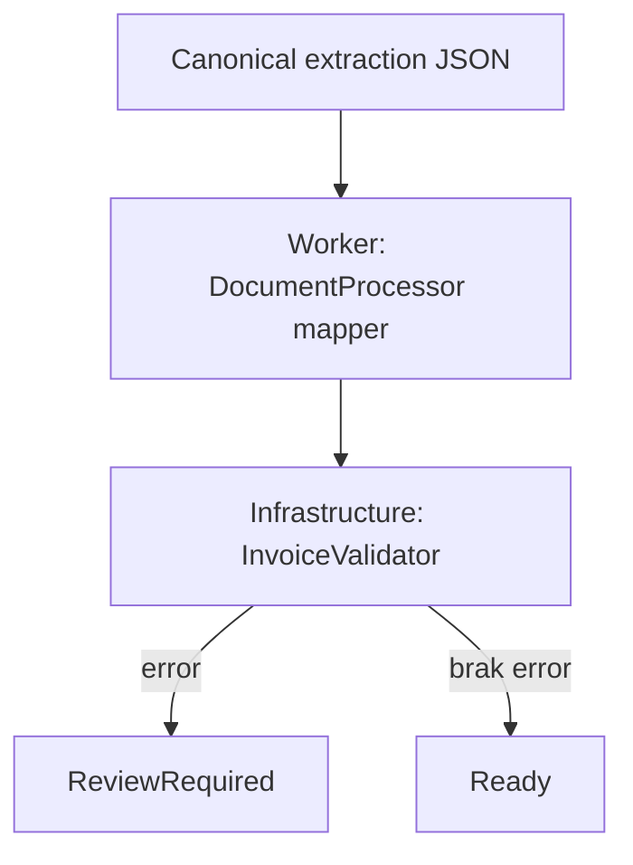

# Walidacja i review

Walidator C# sprawdza NIP, IBAN, wymagane pola, chronologię oraz zgodność totals z pozycjami. Nie zmienia wartości finansowych. Każda uwaga ma kod, poziom i pole; brak błędów jest warunkiem `Ready`.

Edycja wersjonowana, evidence/BBox oraz audyt korekt wymagają rozbudowania modelu trwałego przed uruchomieniem produkcyjnym.

Widok `/documents/{id}` zachowuje issues walidacyjne oraz chronologiczną historię przyjęcia, startu etapów, retry, błędów i restartów. Dla dokumentu `ReviewRequired` przycisk podglądu w kolejce prowadzi do `/documents/{id}/review`: lewa kolumna pokazuje XML wygenerowany z artefaktu ekstrakcji, prawa źródłowy PDF/obraz. To materiał do review, nie zatwierdzony eksport ERP ani zoptymalizowany PDF.
