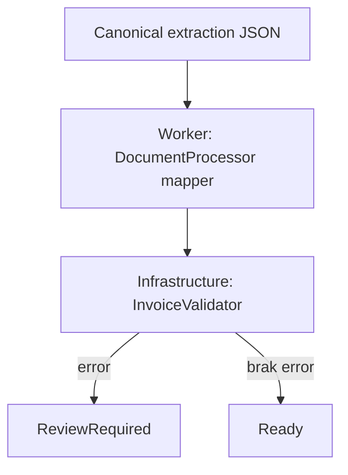

# Walidacja i review

Walidator C# sprawdza NIP, IBAN, wymagane pola, chronologię oraz zgodność totals z pozycjami. Nie zmienia wartości finansowych. Każda uwaga ma kod, poziom i pole; brak błędów jest warunkiem `Ready`.

Edycja wersjonowana, evidence/BBox oraz audyt korekt wymagają rozbudowania modelu trwałego przed uruchomieniem produkcyjnym.
