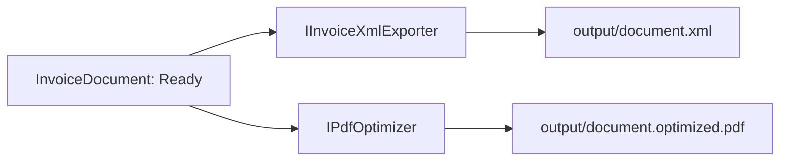
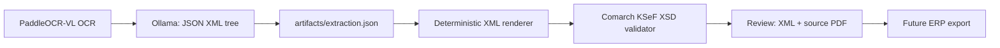

# Artefakty i eksport

Docelowa para eksportowa to deterministyczny XML i lekki PDF. Podgląd review obsługuje pełne drzewo czterech profili 7.77 (`invoice`, `correction`, `ksef`, `ksef-correction`) i waliduje je odpowiednim XSD z `specs/ComarchInvoice`.

Kontrakt JSON v3 zawiera rekursywne, uporządkowane drzewo `name` / `value` / `children`. Z tego powodu każdy element obecny w XSD (do 595 ścieżek w korekcie KSeF), w tym opcjonalne dane transportu, płatności, pozycji, obniżek i załączników, może zostać odwzorowany bez zmiany kodu renderera. Worker przekazuje Ollama kompaktową listę ścieżek i kardynalności wygenerowaną z czterech XSD; model wybiera profil wyłącznie na podstawie widocznych danych OCR.

Renderer nie uzupełnia braków ani nie zmienia kolejności; błąd XSD pozostawia XML widoczny w review z komunikatem walidatora. Dostarczony pakiet jest techniczną rekonstrukcją XSD, nie oficjalnym plikiem Comarch. Eksport do ERP pozostaje osobnym etapem, a reguły Schematron zależne od kontekstu biznesowego wymagają plików `.sch/.xslt`, których nie ma w obecnym katalogu `specs/ComarchInvoice`.
