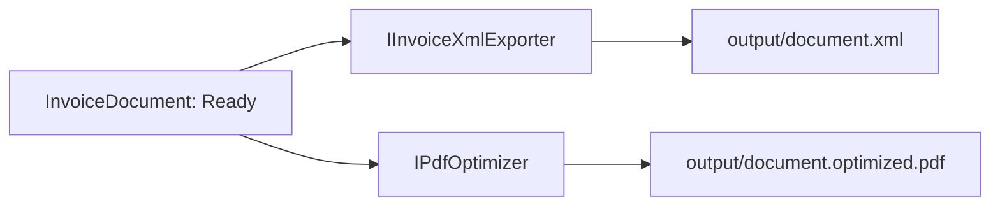

# Artefakty i eksport

Docelowa para eksportowa to deterministyczny XML i lekki PDF. Porty eksportu są zdefiniowane w Application, lecz profil Comarch pozostaje celowo niezaimplementowany: repozytorium nie zawiera zatwierdzonego XSD/specyfikacji. Nie należy tworzyć XML z pamięci ani oznaczać takiego eksportu jako produkcyjnego.
