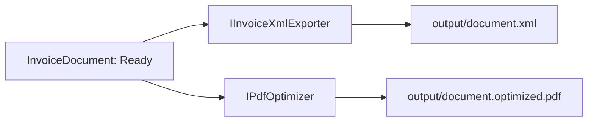
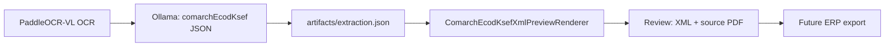

# Artefakty i eksport

Docelowa para eksportowa to deterministyczny XML i lekki PDF. W podglądzie review zaimplementowano profil bazowy `comarch-ecod-ksef-7.77`, odwzorowany z „Faktura XML — ELEKTRONICZNE CENTRUM OBSŁUGI DOKUMENTÓW”, wersja 7.77 z 2025-09-29.

Kontrakt JSON obejmuje `Invoice-Header`, `Invoice-Parties`, `Invoice-Lines` i `Invoice-Summary` wraz z `Tax-Summary`. Renderer nie uzupełnia braków ani nie przelicza kwot: gdy nie ma danych koniecznych do profilu bazowego, pokazuje preflight i pozostawia dokument w review.

Zakres obecny nie obejmuje korekt, załączników, DRS, płatności częściowych ani wszystkich warunków branżowych z 43-stronicowej specyfikacji. Przed produkcyjnym eksportem wymagane są: zatwierdzone XSD Comarch, przykłady komunikatów przyjmowanych przez konkretny ERP oraz test walidacyjny na tych artefaktach. Do tego momentu XML pozostaje podglądem review, a nie artefaktem ERP.
