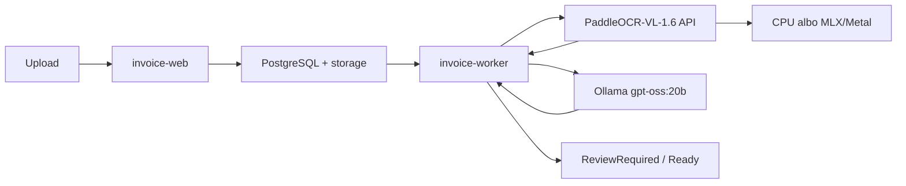

# Lokalny kontener i test przepływu

`paddleocr-vl-api` działa lokalnie w Compose z cachem modeli w named volume. Na Intel/Linux cały pipeline działa na CPU. Na Apple Silicon `dev-up.sh` pozostawia layout w kontenerze i deleguje VLM do hostowego MLX/Metal; szczegóły i pomiar są w [profilach OCR](07-paddleocr-runtime-profiles.md). Web i PostgreSQL są wyłącznie w sieci prywatnej.

Compose udostępnia OCR także jako `http://127.0.0.1:8090` (konfigurowalne `PADDLEOCR_PORT`), wyłącznie na loopback hosta. Profile `Development` Web i Workera używają tego adresu oraz `http://192.168.21.14:11434` dla Ollama; wariant kontenerowy nadal korzysta z nazwy DNS `paddleocr-vl-api` i `OLLAMA_BASE_URL` z `deploy/.env`.

Obrazy Web i Workera publikują się per architektura (`linux-x64`/`linux-arm64`) z ReadyToRun — wspieraną przez .NET formą AOT — bez trimming. Native AOT nie jest tu włączony: aplikacja używa Blazor Interactive Server, którego ten model publikacji nie obsługuje.

Zweryfikowano 2026-07-26: upload obrazu → Paddle `POST /layout-parsing` → `gpt-oss:20b` → walidacja → `ReviewRequired`. Użyta oficjalna próbka boarding pass nie ma NIP, więc ten status jest oczekiwany. Artefakty `ocr.json` i `extraction.json` były poprawnym JSON.
