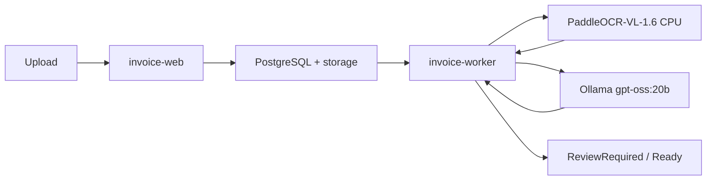

# Lokalny kontener i test przepływu

`paddleocr-vl-api` działa lokalnie w Compose na CPU z cachem modeli w named volume. Web i PostgreSQL są wyłącznie w sieci prywatnej; worker ma dodatkowo wyjście do Ollama oraz do pobrania modelu podczas pierwszego startu.

Zweryfikowano 2026-07-26: upload obrazu → Paddle `POST /layout-parsing` (200 po 182,7 s CPU) → `gpt-oss:20b` → walidacja → `ReviewRequired`. Użyta oficjalna próbka boarding pass nie ma NIP, więc ten status jest oczekiwany. Artefakty `ocr.json` i `extraction.json` były poprawnym JSON.
