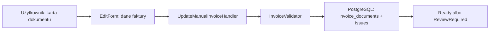

# Ręczne uzupełnianie faktury

Karta dokumentu pozwala uzupełnić numer i daty, walutę, strony, płatność, rachunek oraz sumy. Zapis normalizuje puste wartości, uruchamia walidację C# i zapisuje wynik. Dokument `ReviewRequired` przechodzi do `Ready` tylko bez błędów walidacji; niespójne sumy nadal wymagają korekty.

Ręczna korekta zmienia rekord roboczy i issues. Artefakt `extraction.json` pozostaje niemodyfikowalnym zapisem odpowiedzi Ollama; jego XML jest nadal wyświetlany osobno w review.
