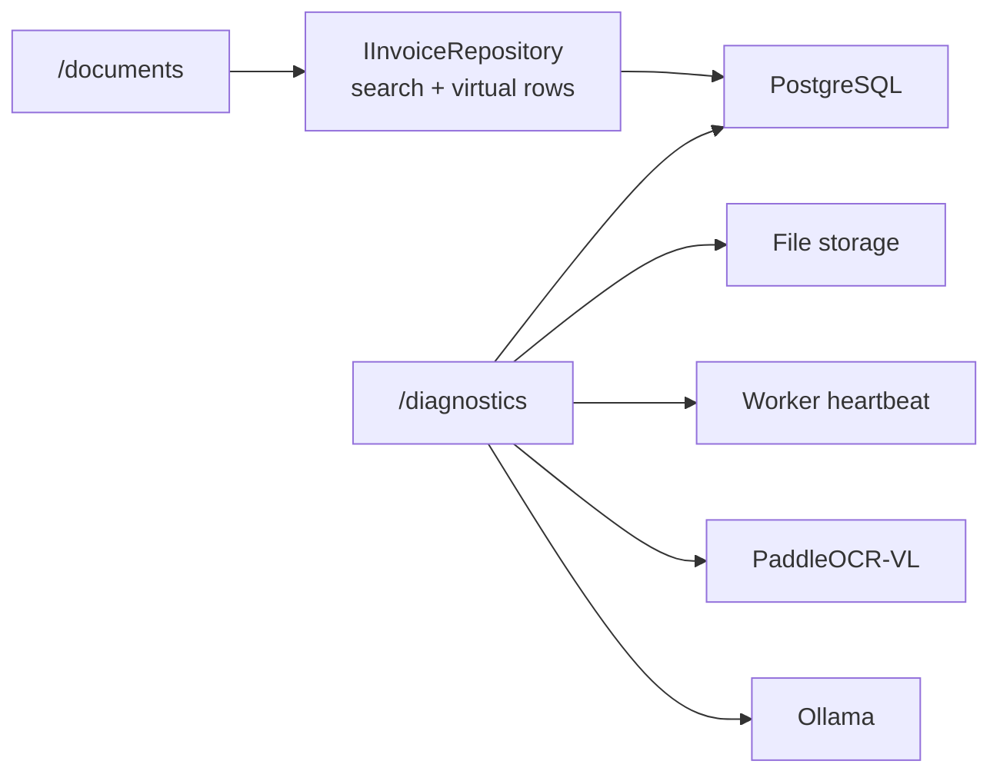

# Widok operacyjny i diagnostyka

Kolejka jest zwartą tabelą z filtrem po nazwie pliku, statusie oraz nazwach i NIP-ach stron. Pierwsza kolumna pokazuje czas uploadu i pierwszego podjęcia przez Worker; dane stron pojawiają się po zapisaniu ekstrakcji.

`/diagnostics` wykonuje na żądanie kontrolę połączenia z PostgreSQL, zapisywalności storage, świeżości heartbeat Workera, zdrowia Paddle i obecności skonfigurowanego modelu Ollama. Nie pokazuje treści dokumentów ani sekretów.
