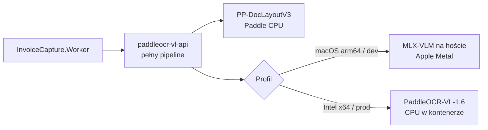

# Profile wykonawcze PaddleOCR-VL

`paddleocr-vl-api` zawsze udostępnia pełny endpoint `/layout-parsing`; aplikacja nie wywołuje samego VLM. Na Apple Silicon kontener wykonuje layout, a ciężkie rozpoznawanie deleguje do hostowego MLX-VLM na `127.0.0.1:8111` przez `host.docker.internal`. Docker Desktop nie udostępnia Metal kontenerom, dlatego MLX działa jako LaunchAgent uruchamiany przez `scripts/paddleocr-mlx.sh`.

`scripts/dev-up.sh` wybiera MLX automatycznie na `Darwin/arm64` i instaluje przypięty `mlx-vlm==0.6.8` w cache użytkownika. Wymuszenie: `PADDLEOCR_DEV_ACCELERATOR=cpu` albo `mlx`. `scripts/dev-down.sh` zatrzymuje także zarządzany LaunchAgent. Profil bazowy `deploy/compose.yml` pozostaje przenośnym wariantem produkcyjnym Intel CPU; oba profile używają PaddleOCR-VL 1.6 i limitu 100 stron.

## Pomiar M3

Oficjalna próbka, rozgrzane modele, ten sam request i pełny JSON:

| Profil | Czas | Zgodność wyniku |
|---|---:|---|
| Docker `linux/arm64`, Paddle CPU | 327,499 s | punkt odniesienia |
| Layout CPU + MLX/Metal, concurrency 4 (pierwszy pomiar) | 19,384 s | ta sama struktura i bloki |
| Layout CPU + MLX/Metal, concurrency 4 (rozgrzany) | 15,504 s | ta sama struktura i 31 bloków |

Przyspieszenie wynosi **16,9×**, a po rozgrzaniu **21,1×**. Metal może dać minimalnie inny tekst niż CPU: w powtórzeniu podobieństwo Markdown wyniosło 99,963%, przy jednym zmienionym bloku. Concurrency 8 dało 18,442 s i dwie różnice bloków, dlatego szybszy po rozgrzaniu i stabilniejszy profil zachowuje `4`.
